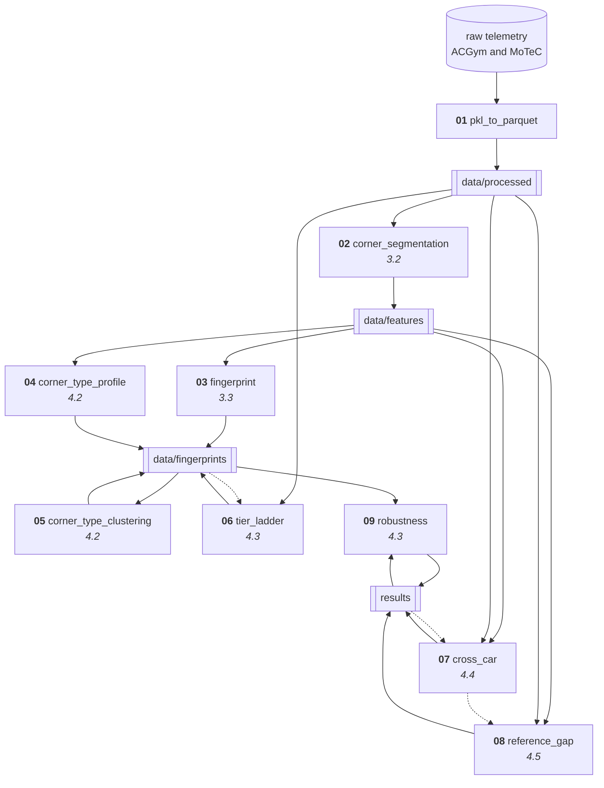

# TRACK

Telemetry-Based Racing Analysis and Coaching Kit

This repository holds the analytical system, the methods and the architecture through which driving and driver behavior are analyzed from sim racing telemetry. It is not offered as a software product; it holds how the accompanying manuscript was carried out and the method it used. The nine Python notebooks here were used to obtain the results and the steps the manuscript reports.

The system works as follows. Corners on the circuits are first detected from the raw telemetry. Each corner pass is then divided into five phases, following how the human and the agent drivers approach the corner. Driving behavior is examined under four dimensions with nineteen metrics. Recording sessions are clustered on the scores obtained from those four dimensions, and the human metrics are finally expressed as ratios against the reference of the reinforcement-learning agents.

---

## 1. Repository layout

```
notebooks/        nine Python notebooks, 01 through 09
src/track/        path resolution
docs/             mapping and reference documents
data/derived/     the derived tables the manuscript reports
figures/          the figures used in the manuscript
requirements.txt  package versions
CITATION.cff      citation metadata
LICENSE           license
```

`notebooks/` is the pipeline itself. The notebooks are numbered in the order they run, and each one opens with an identity card giving what it reads, what it writes, which section of the manuscript it feeds, which working file it was copied from, and the checksum of that file. Section 4 describes what each notebook does.

`src/track/` resolves the data root at run time. Paths are not written into the notebooks, so the repository runs on another machine after a single setting. Section 3 covers the setup.

`docs/PIPELINE.md` records which working file each of the nine notebooks came from, together with their code checksums and a note on provenance.

The notebooks are stored without execution outputs. The results the manuscript reports are in `data/derived/`.

The raw telemetry is not in the repository. Section 2 explains where to obtain it.

---

## 2. Data

The raw telemetry is not in this repository. The full data tree is roughly 164 GB and cannot be distributed under version control. It comes from two separate sources.

### ACGym

The primary source is the dataset presented by Remonda and colleagues at the NeurIPS 2024 Datasets and Benchmarks Track. It is openly available on Hugging Face as `dasgringuen/assettoCorsaGym` under a CC BY 4.0 license. The revision used in this work is `ad1df12c49cce10f159ba31967744750bb9edd8b`.

The dataset's human portion is documented as comprising 15 distinct drivers, recorded on three circuits, Barcelona, Monza and the Red Bull Ring, in three cars. The distribution also covers a fourth circuit, Indianapolis. Human sessions were recorded there, but none of them enter the processed feature set used in this work. The agent reference does include Indianapolis.

### Statement of changes

This work does not redistribute the ACGym data as it stands. The data has been filtered, divided into corner passes, and turned into derived metrics. The filtering criteria and the derivation steps are set out in the notebooks.

### Our own recordings

A second and much smaller source is a set of sessions the first author recorded in Assetto Corsa Competizione through MoTeC. Those recordings are not part of ACGym and are archived separately.

### Without the data

The notebooks can be read, and the tables under `data/derived/` and the figures under `figures/` can be examined. Running the notebooks requires the data.

---

## 3. Setup

Python 3.11 and conda are required. The notebooks were developed and run on Windows; paths are built with `pathlib`, so other operating systems are expected to work, but they have not been tested.

### Repository and environment

```bash
git clone https://github.com/EfeCangirili/TRACK-sim-racing-telemetry.git
cd TRACK-sim-racing-telemetry
conda create -n simracing python=3.11
conda activate simracing
pip install -r requirements.txt
```

### Pointing at the data

The notebooks resolve the data root at run time. The root is the directory that contains `data/features`. Choose one of three ways:

```bash
# environment variable
export TRACK_ROOT=/path/to/root       # Windows: set TRACK_ROOT=D:\path\to\root

# or leave a pointer file in the repository
echo /path/to/root > track_root.txt   # this file is not tracked by git

# or neither: the notebook walks up for a parent holding data/features
```

The root must hold this structure:

```
<TRACK_ROOT>/
  data/
    raw/          raw telemetry
    processed/    per-lap parquet
    features/     corner matrices
    fingerprints/ fingerprint and corner-type outputs
  results/        analysis outputs
```

### Checking the setup

```bash
python -c "import sys; sys.path.insert(0,'src'); from track.config import PROJECT_ROOT, FEATURES; print(PROJECT_ROOT, FEATURES.is_dir())"
```

If the root cannot be found the resolver does not carry on quietly; it stops and names the setting that is missing. The notebooks build the path themselves, so the `sys.path` line above is only for this check.

---

## 4. The pipeline

The nine notebooks run in the order below. A solid arrow is a computational dependency: the notebook it leaves writes a file the notebook it reaches then reads. A dotted arrow is not part of the computation; those are the inventory reads the notebooks perform in their closing cells, listing the outputs already produced and printing a summary.



| Symbol | Meaning |
|---|---|
| solid arrow | computational dependency: the source writes a file the target reads |
| dotted arrow | inventory read: performed in a closing cell, not part of the computation |
| rounded | raw data |
| rectangle | notebook |
| double border | data store |
| italic number | the manuscript section it feeds |

Line style is the only distinguishing mark; no color is used, so the diagram separates for a reader who cannot distinguish colors.

### What each notebook reads and writes

| # | Notebook | Reads | Writes | Section |
|---|---|---|---|---|
| 01 | `pkl_to_parquet` | `data/raw/**/*.pkl` | `data/processed/<tier>/` | |
| 02 | `corner_segmentation` | `data/processed/<tier>/` | `data/features/driver_corner_matrix_<track>.parquet` | 3.2 |
| 03 | `fingerprint` | `data/features/` | `data/fingerprints/fingerprint_cross_track.parquet` | 3.3 |
| 04 | `corner_type_profile` | `data/features/` | `corner_type_profiles_<policy>/corner_type_pivot.parquet` | 4.2 |
| 05 | `corner_type_clustering` | `corner_type_profiles_<policy>/` | `nb7a7b_info.json` | 4.2 |
| 06 | `tier_ladder` | `data/processed/<tier>/*_human.parquet` | `fingerprints/t<n>_<policy>/t<n>_info.json` | 4.3 |
| 07 | `cross_car` | `data/features/`, `data/processed/tier3_large_3t3c/` | `results/cross_car_<policy>/nb16_info.json` | 4.4 |
| 08 | `reference_gap` | `data/features/`, `data/processed/tier3_large_3t3c/` | `results/gap_analysis_<policy>/nb15_info.json` | 4.5 |
| 09 | `robustness` | `data/fingerprints/`, `results/cross_car_<policy>/` | `results/robustness/` | 4.3 |

### What each notebook produces

| # | Produces |
|---|---|
| 01 | Converts the raw session dumps into columnar storage |
| 02 | Builds the corner inventory, the entry, apex and exit points, and the five phases within each corner |
| 03 | Computes the nineteen metrics grouped under four dimensions |
| 04 | Divides corners into three types by speed and builds the per-type profile table |
| 05 | Clusters within each corner type and measures the agreement between types |
| 06 | Tracks cluster separation as coverage widens, reporting each coefficient against its own permutation null |
| 07 | Measures repeatability across cars and identity transfer between them |
| 08 | Expresses the human metrics as ratios against the reinforcement-learning reference |
| 09 | Recomputes the null distributions and compares them with the stored values |

### Population definitions

The study carries two definitions of the population. Notebooks 04 through 08 run once for each definition, that is, twice, writing their outputs to separate directories. Notebooks 01, 02 and 03 are independent of the definition and run once. Notebook 09 reads the outputs of both.

Run times have not been measured.

---

## 5. Output files

The notebooks write their outputs into two trees. Intermediate products and fingerprint tables go under `data/`, analysis outputs under `results/`. Each output carries a JSON record file, which stores the timestamp of the run, the population definition, and the parameters used in that run.

| Notebook | File written | Contents |
|---|---|---|
| 02 | `data/features/driver_corner_matrix_<track>.parquet` | per-corner driver measurements |
| 02 | `data/features/driver_meta_<track>.parquet` | session metadata |
| 03 | `data/fingerprints/fingerprint_cross_track.parquet` | cross-track fingerprint |
| 03 | `data/fingerprints/v3_info.json` | run record |
| 04 | `corner_type_profiles_<policy>/corner_type_pivot.parquet` | driver by corner-type features |
| 04 | `corner_type_profiles_<policy>/corner_type_profile_crosstrack.parquet` | long form, per type |
| 04 | `corner_type_profiles_<policy>/nb7a7_info.json` | corner inventory, type thresholds, trail shares |
| 05 | `corner_type_profiles_<policy>/nb7a7b_info.json` | pooled and within-type cluster measures, agreement between types |
| 06 | `data/fingerprints/t<n>_<policy>/t<n>_info.json` | per-tier cluster measures and cross-validation |
| 07 | `results/cross_car_<policy>/nb16_info.json` | repeatability, identity transfer, calibration |
| 07 | `results/cross_car_<policy>/repeatability_per_metric.csv` | repeatability per metric |
| 08 | `results/gap_analysis_<policy>/nb15_info.json` | reference matrix, metric classification, ratios |
| 09 | `results/robustness/nb17_robustness_<stamp>.json` | recomputed null distributions |

Every `*_info.json` carries `notebook`, `run_timestamp`, `identity_policy`, and the list of records excluded in that run. Notebooks that use randomness also write a `seed` field.

The record files are named after the working notebooks they were produced by, and that numbering differs from the numbering used in this repository. The table above gives the correspondence.

The files under `data/derived/` are generated from these run outputs. The raw run outputs are not in the repository.

---

## 6. Seeds and versions

Four of the nine notebooks use no randomness and are deterministic: 01, 02, 04 and 08. The remaining five contain clustering, permutation or subsampling steps.

| Notebook | Source of randomness |
|---|---|
| 03 | k-means |
| 05 | k-means |
| 06 | k-means, fuzzy c-means |
| 07 | permutation tests, bootstrap, calibration |
| 09 | permutation nulls, subsampling, k-means |

Every step that uses randomness runs with a fixed seed. The value used is 42; the calibration routine in 07 and one helper in 09 take a separate fixed seed. Where draws are repeated, the seed is offset by the replicate index, so the replicates stay independent of one another and are reproduced in the same order.

Notebooks that use randomness write the seed value into their record file. The other parameters are recorded in the same file; see section 5.

Generators are created as objects through `numpy.random.default_rng`. No module-level global random state is used.

The code was run under Python 3.11.15 in a conda environment named `simracing`. `requirements.txt` lists the packages the notebooks actually import, at the versions present in that environment. The package records of that environment last changed on 2026-07-19.

---

## 7. License

The code in this repository is released under the MIT license. The full text is in `LICENSE`.

The code license and the data license are separate and do not stand in for one another.

| Item | License |
|---|---|
| The code and notebooks in this repository | MIT |
| The ACGym dataset | CC BY 4.0 |
| The ACGym reference implementation | MIT |

The ACGym data is distributed under the Creative Commons Attribution 4.0 International license: <https://creativecommons.org/licenses/by/4.0/>. That license asks work using the data to credit the creators, to link to the license, and to state the changes made. The changes made in this work are described in section 2.

---

## 8. Citation

Work that uses this repository should cite both the software and the manuscript it accompanies. The machine-readable metadata is in `CITATION.cff`; GitHub renders a formatted citation from that file.

When the data itself is used, ACGym is cited separately and directly:

> Remonda, A.; Hansen, N.; Raji, A.; Musiu, N.; Bertogna, M.; Veas, E. E.; Wang, X. A Simulation Benchmark for Autonomous Racing with Large-Scale Human Data. *Advances in Neural Information Processing Systems 37 (NeurIPS 2024), Datasets and Benchmarks Track*, 2024.
